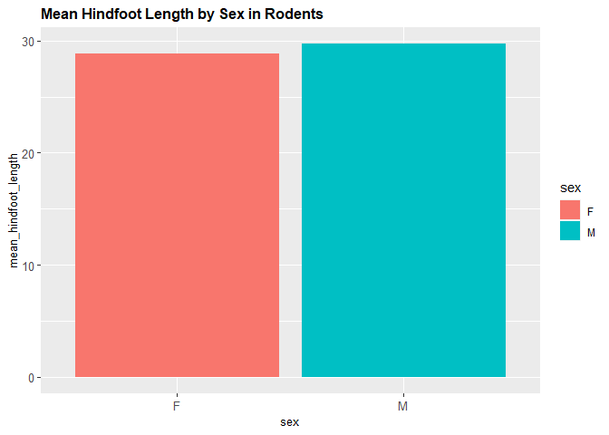

## Instructions
Answer the following questions and complete the exercises in RMarkdown. Please embed all of your code and push your final work to your repository. Your final lab report should be organized, clean, and run free from errors. Remember, you must remove the `#` for the included code chunks to run. Be sure to add your name to the author header above. For any included plots, make sure they are clearly labeled. You are free to use any plot type that you feel best communicates the results of your analysis.  

Make sure to use the formatting conventions of RMarkdown to make your report neat and clean!  

## Load the libraries

```r
library(tidyverse)
library(janitor)
library(here)
library(naniar)
```

## Desert Ecology
For this assignment, we are going to use a modified data set on [desert ecology](http://esapubs.org/archive/ecol/E090/118/). The data are from: S. K. Morgan Ernest, Thomas J. Valone, and James H. Brown. 2009. Long-term monitoring and experimental manipulation of a Chihuahuan Desert ecosystem near Portal, Arizona, USA. Ecology 90:1708.

```r
deserts <- read_csv(here("lab10", "data", "surveys_complete.csv"))
```

```
## 
## -- Column specification --------------------------------------------------------
## cols(
##   record_id = col_double(),
##   month = col_double(),
##   day = col_double(),
##   year = col_double(),
##   plot_id = col_double(),
##   species_id = col_character(),
##   sex = col_character(),
##   hindfoot_length = col_double(),
##   weight = col_double(),
##   genus = col_character(),
##   species = col_character(),
##   taxa = col_character(),
##   plot_type = col_character()
## )
```

1. Use the function(s) of your choice to get an idea of its structure, including how NA's are treated. Are the data tidy?  
**Data looks tidy.**

```r
glimpse(deserts)
```

```
## Rows: 34,786
## Columns: 13
## $ record_id       <dbl> 1, 2, 3, 4, 5, 6, 7, 8, 9, 10, 11, 12, 13, 14, 15, ...
## $ month           <dbl> 7, 7, 7, 7, 7, 7, 7, 7, 7, 7, 7, 7, 7, 7, 7, 7, 7, ...
## $ day             <dbl> 16, 16, 16, 16, 16, 16, 16, 16, 16, 16, 16, 16, 16,...
## $ year            <dbl> 1977, 1977, 1977, 1977, 1977, 1977, 1977, 1977, 197...
## $ plot_id         <dbl> 2, 3, 2, 7, 3, 1, 2, 1, 1, 6, 5, 7, 3, 8, 6, 4, 3, ...
## $ species_id      <chr> "NL", "NL", "DM", "DM", "DM", "PF", "PE", "DM", "DM...
## $ sex             <chr> "M", "M", "F", "M", "M", "M", "F", "M", "F", "F", "...
## $ hindfoot_length <dbl> 32, 33, 37, 36, 35, 14, NA, 37, 34, 20, 53, 38, 35,...
## $ weight          <dbl> NA, NA, NA, NA, NA, NA, NA, NA, NA, NA, NA, NA, NA,...
## $ genus           <chr> "Neotoma", "Neotoma", "Dipodomys", "Dipodomys", "Di...
## $ species         <chr> "albigula", "albigula", "merriami", "merriami", "me...
## $ taxa            <chr> "Rodent", "Rodent", "Rodent", "Rodent", "Rodent", "...
## $ plot_type       <chr> "Control", "Long-term Krat Exclosure", "Control", "...
```


```r
naniar::miss_var_summary(deserts)
```

```
## # A tibble: 13 x 3
##    variable        n_miss pct_miss
##    <chr>            <int>    <dbl>
##  1 hindfoot_length   3348     9.62
##  2 weight            2503     7.20
##  3 sex               1748     5.03
##  4 record_id            0     0   
##  5 month                0     0   
##  6 day                  0     0   
##  7 year                 0     0   
##  8 plot_id              0     0   
##  9 species_id           0     0   
## 10 genus                0     0   
## 11 species              0     0   
## 12 taxa                 0     0   
## 13 plot_type            0     0
```

```r
names(deserts)
```

```
##  [1] "record_id"       "month"           "day"             "year"           
##  [5] "plot_id"         "species_id"      "sex"             "hindfoot_length"
##  [9] "weight"          "genus"           "species"         "taxa"           
## [13] "plot_type"
```

2. How many genera and species are represented in the data? What are the total number of observations? Which species is most/ least frequently sampled in the study?
**26 genera and 40 Species are represented in the data.**

```r
deserts %>%
  summarize(n_genera = n_distinct(genus),
            n_species = n_distinct(species))
```

```
## # A tibble: 1 x 2
##   n_genera n_species
##      <int>     <int>
## 1       26        40
```
**The total number of observations is 34786.**

```r
deserts %>%
  count(genus, species) %>%
  summarize(total_n_obs = sum(n))
```

```
## # A tibble: 1 x 1
##   total_n_obs
##         <int>
## 1       34786
```
**The most frequently sampled species in the study is merriami.**

```r
deserts %>%
  count(species) %>%
  arrange(desc(n))
```

```
## # A tibble: 40 x 2
##    species          n
##    <chr>        <int>
##  1 merriami     10596
##  2 penicillatus  3123
##  3 ordii         3027
##  4 baileyi       2891
##  5 megalotis     2609
##  6 spectabilis   2504
##  7 torridus      2249
##  8 flavus        1597
##  9 eremicus      1299
## 10 albigula      1252
## # ... with 30 more rows
```
**The least frequently sampled species are clarki, tereticaudus, tigris, uniparens, scutalatus, viridis.**

```r
deserts %>%
  count(species) %>%
  top_n(-7, n) %>%
  arrange(-desc(n))
```

```
## # A tibble: 8 x 2
##   species          n
##   <chr>        <int>
## 1 clarki           1
## 2 scutalatus       1
## 3 tereticaudus     1
## 4 tigris           1
## 5 uniparens        1
## 6 viridis          1
## 7 leucophrys       2
## 8 savannarum       2
```

3. What is the proportion of taxa included in this study? Show a table and plot that reflects this count.

```r
deserts %>%
  count(taxa)
```

```
## # A tibble: 4 x 2
##   taxa        n
## * <chr>   <int>
## 1 Bird      450
## 2 Rabbit     75
## 3 Reptile    14
## 4 Rodent  34247
```

```r
deserts %>%
ggplot(aes(x=taxa, fill = taxa))+ #use "fill" in ggplot area
  geom_bar()+
  labs(title = "Proportion of Taxa",
       x = "taxa")+
  scale_y_log10()
```

<!-- -->

4. For the taxa included in the study, use the fill option to show the proportion of individuals sampled by `plot_type.`

```r
deserts %>%
  count(taxa, plot_type)
```

```
## # A tibble: 19 x 3
##    taxa    plot_type                     n
##    <chr>   <chr>                     <int>
##  1 Bird    Control                     110
##  2 Bird    Long-term Krat Exclosure     67
##  3 Bird    Rodent Exclosure            118
##  4 Bird    Short-term Krat Exclosure   131
##  5 Bird    Spectab exclosure            24
##  6 Rabbit  Control                      29
##  7 Rabbit  Long-term Krat Exclosure     17
##  8 Rabbit  Rodent Exclosure             24
##  9 Rabbit  Short-term Krat Exclosure     2
## 10 Rabbit  Spectab exclosure             3
## 11 Reptile Control                       6
## 12 Reptile Long-term Krat Exclosure      3
## 13 Reptile Rodent Exclosure              1
## 14 Reptile Short-term Krat Exclosure     4
## 15 Rodent  Control                   15466
## 16 Rodent  Long-term Krat Exclosure   5031
## 17 Rodent  Rodent Exclosure           4090
## 18 Rodent  Short-term Krat Exclosure  5769
## 19 Rodent  Spectab exclosure          3891
```


```r
deserts %>%
ggplot(aes(x=taxa, fill = plot_type))+ 
  geom_bar()+
  labs(title = "Proportion of Taxa by Plot Type",
       x = "taxa")+
  scale_y_log10()
```

<!-- -->

5. What is the range of weight for each species included in the study? Remove any observations of weight that are NA so they do not show up in the plot.

```r
deserts %>%
  group_by(species) %>%
  filter(weight!="NA") %>%
  summarize(min_weight = min(weight, na.rm = T),
            max_weight = max(weight, na.rm = T))
```

```
## # A tibble: 22 x 3
##    species     min_weight max_weight
##    <chr>            <dbl>      <dbl>
##  1 albigula            30        280
##  2 baileyi             12         55
##  3 eremicus             8         40
##  4 flavus               4         25
##  5 fulvescens           9         20
##  6 fulviventer         24        199
##  7 hispidus            16        140
##  8 intermedius         17         21
##  9 leucogaster         10         56
## 10 leucopus             8         27
## # ... with 12 more rows
```

```r
deserts %>%
  filter(weight!="NA") %>%
  ggplot(aes(x=species, y=weight))+
  geom_boxplot(na.rm = T)+
  labs(title = "Weight Ranges for Individual Species")+
  coord_flip()+
  scale_y_log10()
```

<!-- -->

6. Add another layer to your answer from #5 using `geom_point` to get an idea of how many measurements were taken for each species.

```r
deserts %>%
  filter(weight!="NA") %>%
  ggplot(aes(x=species, y=weight))+
  geom_boxplot(na.rm = T)+
  geom_point()+
  labs(title = "Weight Ranges for Individual Species")+
  coord_flip()+
  scale_y_log10()
```

<!-- -->

7. [Dipodomys merriami](https://en.wikipedia.org/wiki/Merriam's_kangaroo_rat) is the most frequently sampled animal in the study. How have the number of observations of this species changed over the years included in the study?

```r
names(deserts)
```

```
##  [1] "record_id"       "month"           "day"             "year"           
##  [5] "plot_id"         "species_id"      "sex"             "hindfoot_length"
##  [9] "weight"          "genus"           "species"         "taxa"           
## [13] "plot_type"
```


```r
deserts %>%
  filter(species=="merriami") %>%
  group_by(year) %>%
  summarize(n_observations = n())
```

```
## # A tibble: 26 x 2
##     year n_observations
##  * <dbl>          <int>
##  1  1977            264
##  2  1978            389
##  3  1979            209
##  4  1980            493
##  5  1981            559
##  6  1982            609
##  7  1983            528
##  8  1984            396
##  9  1985            667
## 10  1986            406
## # ... with 16 more rows
```

```r
deserts %>%
  filter(species=="merriami") %>%
  group_by(year) %>%
  summarize(n_observations = n()) %>%
  ggplot(aes(x=year, y=n_observations))+
  geom_col()+
  labs(title = "Number of Observations for merriami (1977-2002)")
```

<!-- -->

8. What is the relationship between `weight` and `hindfoot` length? Consider whether or not over plotting is an issue.
**There seems to be a positive correlation between weight and hindfoot length, however, that may not necessarily be the case because the scatterplot also shows values that increase in weight but maintain a constant hindfoot length.**

```r
deserts %>%
  ggplot(aes(x=weight, y=hindfoot_length))+
  geom_point(alpha=0.1, na.rm = T)+
  geom_smooth(method=lm, se=T, na.rm = T)+
  labs(title = "Weight Vs. Hindfoot Length")
```

```
## `geom_smooth()` using formula 'y ~ x'
```

<!-- -->

9. Which two species have, on average, the highest weight? Once you have identified them, make a new column that is a ratio of `weight` to `hindfoot_length`. Make a plot that shows the range of this new ratio and fill by sex.
**On average, albigula and spectabilis have the highest weights.** 

```r
deserts %>%
  filter(weight!="NA") %>%
  group_by(species) %>%
  summarize(mean_weight = mean(weight)) %>%
  arrange(desc(mean_weight))
```

```
## # A tibble: 22 x 2
##    species      mean_weight
##    <chr>              <dbl>
##  1 albigula           159. 
##  2 spectabilis        120. 
##  3 spilosoma           93.5
##  4 hispidus            65.6
##  5 fulviventer         58.9
##  6 ochrognathus        55.4
##  7 ordii               48.9
##  8 merriami            43.2
##  9 baileyi             31.7
## 10 leucogaster         31.6
## # ... with 12 more rows
```

```r
deserts %>%
  filter(weight!="NA" & hindfoot_length!="NA" & sex!="NA") %>%
  select(species, sex, weight, hindfoot_length) %>%
  filter(species=="albigula" | species=="spectabilis") %>%
  mutate(weight_hindfoot_ratio = weight/hindfoot_length)
```

```
## # A tibble: 3,068 x 5
##    species     sex   weight hindfoot_length weight_hindfoot_ratio
##    <chr>       <chr>  <dbl>           <dbl>                 <dbl>
##  1 spectabilis F        117              50                  2.34
##  2 spectabilis F        121              51                  2.37
##  3 spectabilis M        115              51                  2.25
##  4 spectabilis F        120              48                  2.5 
##  5 spectabilis F        118              48                  2.46
##  6 spectabilis F        126              52                  2.42
##  7 spectabilis M        132              50                  2.64
##  8 spectabilis F        122              53                  2.30
##  9 spectabilis F        107              48                  2.23
## 10 spectabilis F        115              50                  2.3 
## # ... with 3,058 more rows
```

```r
deserts %>%
  filter(weight!="NA" & hindfoot_length!="NA"& sex!="NA") %>%
  select(species, weight, hindfoot_length, sex) %>%
  filter(species=="albigula" | species=="spectabilis") %>%
  mutate(weight_hindfoot_ratio = weight/hindfoot_length) %>%
  ggplot(aes(x=species, y=weight_hindfoot_ratio, fill=sex))+
  geom_boxplot()+
  labs(title = "Weight to Hindfoot Length Ratio in albigula and spectabilis")
```

<!-- -->

10. Make one plot of your choice! Make sure to include at least two of the aesthetics options you have learned.

```r
deserts %>%
  filter(hindfoot_length!="NA" & sex!="NA") %>%
  filter(taxa=="Rodent") %>%
  group_by(sex) %>%
  summarize(mean_hindfoot_length = mean(hindfoot_length))
```

```
## # A tibble: 2 x 2
##   sex   mean_hindfoot_length
## * <chr>                <dbl>
## 1 F                     28.8
## 2 M                     29.7
```

```r
deserts %>%
  filter(hindfoot_length!="NA" & sex!="NA") %>%
  filter(taxa=="Rodent") %>%
  group_by(sex) %>%
  summarize(mean_hindfoot_length = mean(hindfoot_length)) %>%
  ggplot(aes(x=sex, y=mean_hindfoot_length, fill=sex))+
  geom_col()+
  labs(title = "Mean Hindfoot Length by Sex in Rodents")+
  theme(plot.title = element_text(size = 12, face = "bold"),
        axis.text = element_text(size = 10),
        axis.title = element_text(size = 10))
```

<!-- -->

## Push your final code to GitHub!
Please be sure that you check the `keep md` file in the knit preferences. 
