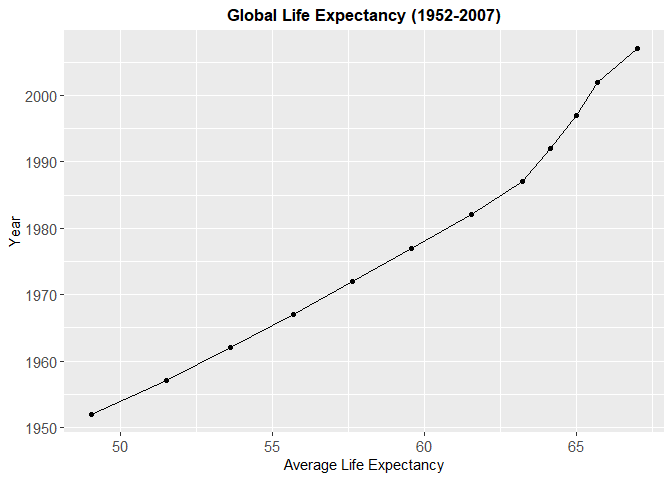
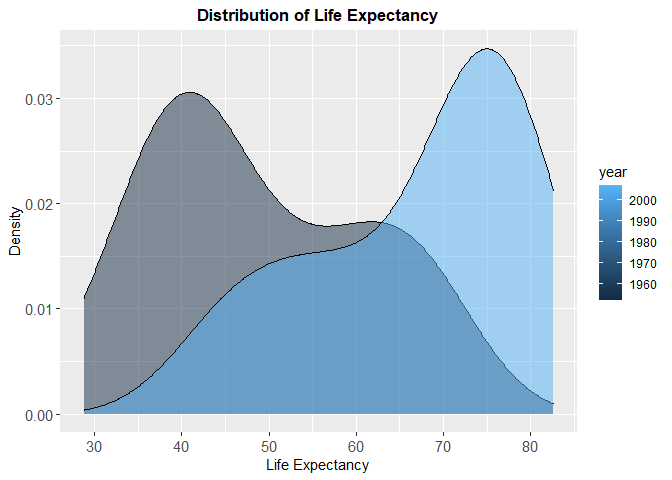
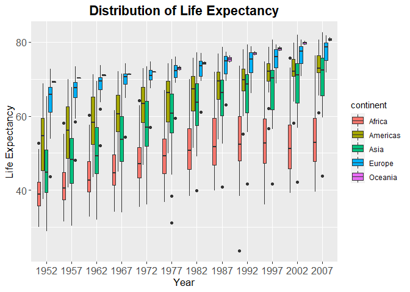
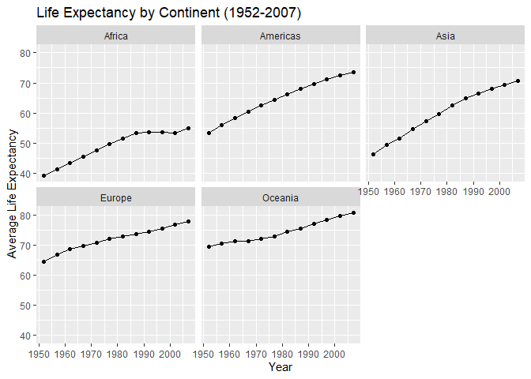
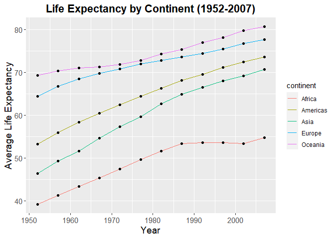
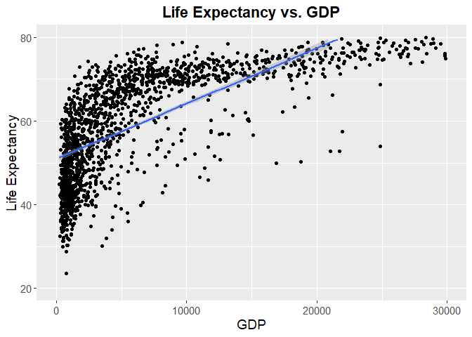
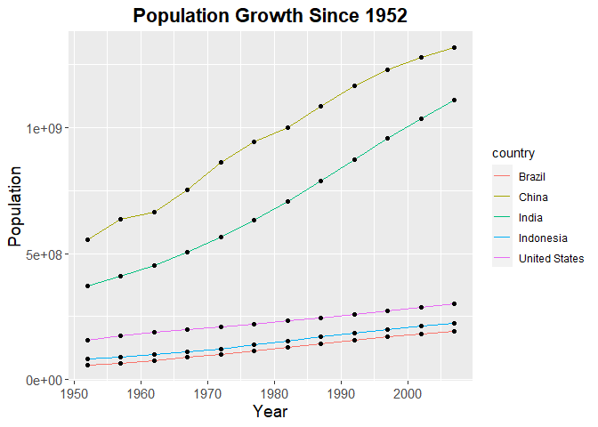
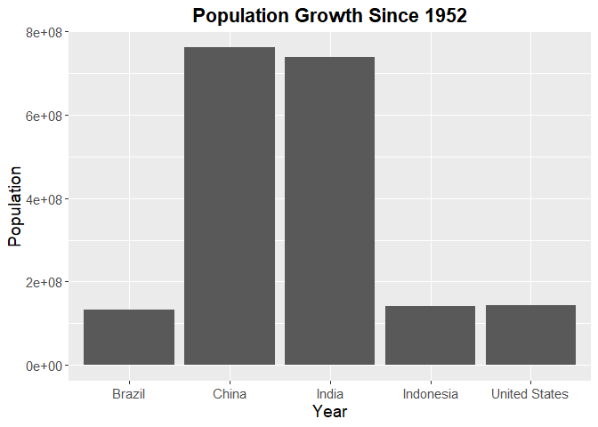
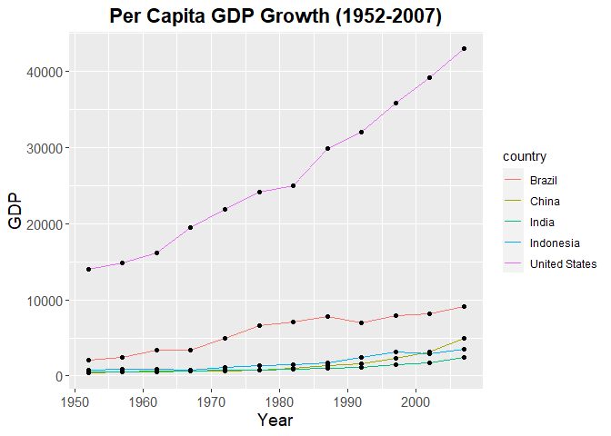
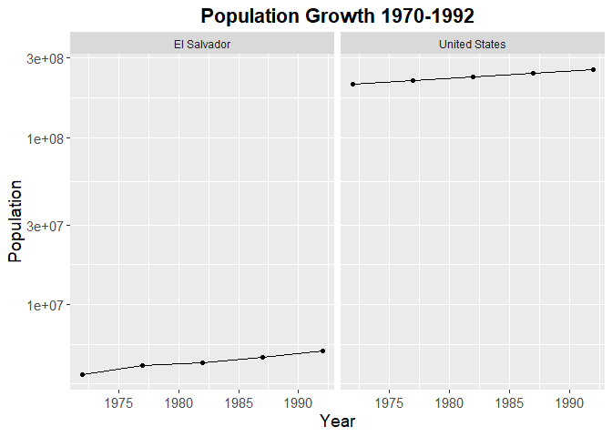

## Instructions
Answer the following questions and complete the exercises in RMarkdown. Please embed all of your code and push your final work to your repository. Your final lab report should be organized, clean, and run free from errors. Remember, you must remove the `#` for the included code chunks to run. Be sure to add your name to the author header above. For any included plots, make sure they are clearly labeled. You are free to use any plot type that you feel best communicates the results of your analysis.  

**In this homework, you should make use of the aesthetics you have learned. It's OK to be flashy!**

Make sure to use the formatting conventions of RMarkdown to make your report neat and clean!  

## Load the libraries

```r
library(tidyverse)
library(janitor)
library(here)
library(naniar)
library(ggplot2)
library(viridis)
```

## Resources
The idea for this assignment came from [Rebecca Barter's](http://www.rebeccabarter.com/blog/2017-11-17-ggplot2_tutorial/) ggplot tutorial so if you get stuck this is a good place to have a look.  

## Gapminder
For this assignment, we are going to use the dataset [gapminder](https://cran.r-project.org/web/packages/gapminder/index.html). Gapminder includes information about economics, population, and life expectancy from countries all over the world. You will need to install it before use. This is the same data that we will use for midterm 2 so this is good practice.

```r
#install.packages("gapminder")
library("gapminder")
```

## Questions
The questions below are open-ended and have many possible solutions. Your approach should, where appropriate, include numerical summaries and visuals. Be creative; assume you are building an analysis that you would ultimately present to an audience of stakeholders. Feel free to try out different `geoms` if they more clearly present your results.  

**1. Use the function(s) of your choice to get an idea of the overall structure of the data frame, including its dimensions, column names, variable classes, etc. As part of this, determine how NA's are treated in the data.**  

```r
glimpse(gapminder)
```

```
## Rows: 1,704
## Columns: 6
## $ country   <fct> Afghanistan, Afghanistan, Afghanistan, Afghanistan, Afgha...
## $ continent <fct> Asia, Asia, Asia, Asia, Asia, Asia, Asia, Asia, Asia, Asi...
## $ year      <int> 1952, 1957, 1962, 1967, 1972, 1977, 1982, 1987, 1992, 199...
## $ lifeExp   <dbl> 28.801, 30.332, 31.997, 34.020, 36.088, 38.438, 39.854, 4...
## $ pop       <int> 8425333, 9240934, 10267083, 11537966, 13079460, 14880372,...
## $ gdpPercap <dbl> 779.4453, 820.8530, 853.1007, 836.1971, 739.9811, 786.113...
```

```r
structure(gapminder)
```

```
## # A tibble: 1,704 x 6
##    country     continent  year lifeExp      pop gdpPercap
##    <fct>       <fct>     <int>   <dbl>    <int>     <dbl>
##  1 Afghanistan Asia       1952    28.8  8425333      779.
##  2 Afghanistan Asia       1957    30.3  9240934      821.
##  3 Afghanistan Asia       1962    32.0 10267083      853.
##  4 Afghanistan Asia       1967    34.0 11537966      836.
##  5 Afghanistan Asia       1972    36.1 13079460      740.
##  6 Afghanistan Asia       1977    38.4 14880372      786.
##  7 Afghanistan Asia       1982    39.9 12881816      978.
##  8 Afghanistan Asia       1987    40.8 13867957      852.
##  9 Afghanistan Asia       1992    41.7 16317921      649.
## 10 Afghanistan Asia       1997    41.8 22227415      635.
## # ... with 1,694 more rows
```

```r
summary(gapminder)
```

```
##         country        continent        year         lifeExp     
##  Afghanistan:  12   Africa  :624   Min.   :1952   Min.   :23.60  
##  Albania    :  12   Americas:300   1st Qu.:1966   1st Qu.:48.20  
##  Algeria    :  12   Asia    :396   Median :1980   Median :60.71  
##  Angola     :  12   Europe  :360   Mean   :1980   Mean   :59.47  
##  Argentina  :  12   Oceania : 24   3rd Qu.:1993   3rd Qu.:70.85  
##  Australia  :  12                  Max.   :2007   Max.   :82.60  
##  (Other)    :1632                                                
##       pop              gdpPercap       
##  Min.   :6.001e+04   Min.   :   241.2  
##  1st Qu.:2.794e+06   1st Qu.:  1202.1  
##  Median :7.024e+06   Median :  3531.8  
##  Mean   :2.960e+07   Mean   :  7215.3  
##  3rd Qu.:1.959e+07   3rd Qu.:  9325.5  
##  Max.   :1.319e+09   Max.   :113523.1  
## 
```


```r
any_na(gapminder)
```

```
## [1] FALSE
```

```r
naniar::miss_var_summary(gapminder)
```

```
## # A tibble: 6 x 3
##   variable  n_miss pct_miss
##   <chr>      <int>    <dbl>
## 1 country        0        0
## 2 continent      0        0
## 3 year           0        0
## 4 lifeExp        0        0
## 5 pop            0        0
## 6 gdpPercap      0        0
```

```r
gapminder %>%
  summarise_all(~(sum(is.na(.))))
```

```
## # A tibble: 1 x 6
##   country continent  year lifeExp   pop gdpPercap
##     <int>     <int> <int>   <int> <int>     <int>
## 1       0         0     0       0     0         0
```

```r
gapminder <- janitor::clean_names(gapminder)
```

**2. Among the interesting variables in gapminder is life expectancy. How has global life expectancy changed between 1952 and 2007?**
**Global life expectancy has increased.**

```r
gapminder %>%
  filter(between(year, 1952, 2007)) %>%
  group_by(year) %>%
  summarize(mean_life_exp = mean(life_exp))
```

```
## # A tibble: 12 x 2
##     year mean_life_exp
##  * <int>         <dbl>
##  1  1952          49.1
##  2  1957          51.5
##  3  1962          53.6
##  4  1967          55.7
##  5  1972          57.6
##  6  1977          59.6
##  7  1982          61.5
##  8  1987          63.2
##  9  1992          64.2
## 10  1997          65.0
## 11  2002          65.7
## 12  2007          67.0
```

```r
gapminder %>%
  filter(between(year, 1952, 2007)) %>%
  group_by(year) %>%
  summarize(mean_life_exp = mean(life_exp)) %>%
  ggplot(aes(x=mean_life_exp, y=year))+
  geom_line()+
  geom_point()+
  labs(title = "Global Life Expectancy (1952-2007)",
       x="Average Life Expectancy", y="Year")+
  theme(plot.title = element_text(size = 13, hjust = 0.5, face = "bold"),
        axis.text = element_text(size = 11),
        axis.title = element_text(size = 11))
```

<!-- -->

**3. How do the distributions of life expectancy compare for the years 1952 and 2007?**
**They look very similar because life expectancy increased during both years at a similar pace.**

```r
gapminder %>%
  filter(year==1952 | year==2007) %>%
  group_by(year) %>%
  summarize(mean_life_exp = mean(life_exp),
            min_life_exp = min(life_exp),
            max_life_exp = max(life_exp), .groups="keep") 
```

```
## # A tibble: 2 x 4
## # Groups:   year [2]
##    year mean_life_exp min_life_exp max_life_exp
##   <int>         <dbl>        <dbl>        <dbl>
## 1  1952          49.1         28.8         72.7
## 2  2007          67.0         39.6         82.6
```


```r
gapminder %>%
  filter(year==1952 | year==2007) %>%
  ggplot(aes(x=life_exp, group=year, fill=year)) +
    geom_density(adjust=1.5, alpha=.5)+
  labs(title = "Distribution of Life Expectancy",
       x="Life Expectancy",
       y="Density")+
  theme(plot.title = element_text(size = 13, hjust = 0.5, face = "bold"),
        axis.text = element_text(size = 11),
        axis.title = element_text(size = 11))
```

<!-- -->

**4. Your answer above doesn't tell the whole story since life expectancy varies by region. Make a summary that shows the min, mean, and max life expectancy by continent for all years represented in the data.**

```r
names(gapminder)
```

```
## [1] "country"    "continent"  "year"       "life_exp"   "pop"       
## [6] "gdp_percap"
```


```r
gapminder_2 <- gapminder %>%
  group_by(continent, year, life_exp) %>%
  summarize(min_life_exp = min(life_exp),
            mean_life_exp = mean(life_exp),
            max_life_exp = max(life_exp), .groups="keep")
```


```r
gapminder_2$year <- as.factor(gapminder_2$year)
```


```r
gapminder_2 %>%
  group_by(year) %>%
  ggplot(aes(x=year, y=life_exp, fill=continent))+
  geom_boxplot()+
  labs(title = "Distribution of Life Expectancy",
       x="Year", y="Life Expectancy")+
  theme(plot.title = element_text(size = rel(1.5), hjust = 0.5, face = "bold"),
        axis.text = element_text(size = 12),
        axis.title = element_text(size = 13))
```

<!-- -->

**5. How has life expectancy changed between 1952-2007 for each continent?**
**Life expectancy has increased for each continent.**

```r
change_life_exp <- gapminder %>%
  filter(between(year, 1952, 2007)) %>%
  group_by(continent, year) %>%
  summarize(mean_life_exp = mean(life_exp), .groups="keep") %>%
  ggplot(aes(x=year, y=mean_life_exp))+
  geom_line()+
  geom_point()+
  labs(title = "Life Expectancy by Continent (1952-2007)",
       x="Year",
       y="Average Life Expectancy")
```


```r
change_life_exp+ facet_wrap(~continent)
```

<!-- -->
**This is a second plot I made, for practice, showing the same data above, but condensed into one plot.**

```r
gapminder %>%
  filter(between(year, 1952, 2007)) %>%
  group_by(continent, year) %>%
  summarize(mean_life_exp = mean(life_exp), .groups="keep") %>%
  ggplot(aes(x=year, y=mean_life_exp))+
  geom_line(aes(color=continent))+
  geom_point()+
  labs(title = "Life Expectancy by Continent (1952-2007)",
       x="Year",
       y="Average Life Expectancy")+
  theme(plot.title = element_text(size = rel(1.5), hjust = 0.5, face = "bold"),
        axis.text = element_text(size = 11),
        axis.title = element_text(size = 14))
```

<!-- -->

**6. We are interested in the relationship between per capita GDP and life expectancy; i.e. does having more money help you live longer?**

```r
gapminder %>%
  ggplot(aes(x=gdp_percap, y=life_exp))+
  geom_jitter()+
  geom_smooth(method=lm, se=T)+ #don't need geom_point() if using geom_smooth
  labs(title = "Life Expectancy vs. GDP",
       x="GDP",
       y="Life Expectancy")+
  theme(plot.title = element_text(size = rel(1.5), hjust = 0.5, face = "bold"),
        axis.text = element_text(size = 11),
        axis.title = element_text(size = 14))+
  xlim(0, 30000) + #xlim and ylim lets you zoom in on the points within the range you specified
  ylim(20, 80)
```

```
## `geom_smooth()` using formula 'y ~ x'
```

```
## Warning: Removed 64 rows containing non-finite values (stat_smooth).
```

```
## Warning: Removed 65 rows containing missing values (geom_point).
```

```
## Warning: Removed 22 rows containing missing values (geom_smooth).
```

<!-- -->

**7. Which countries have had the largest population growth since 1952?**
**The top five countries with the greatest population growth are China, India, United States, Indonesia, and Brazil.**

```r
gapminder %>%
  filter(year>=1952) %>%
  group_by(country) %>%
  summarize(max_pop = max(pop),
            min_pop = min(pop)) %>%
  mutate(pop_growth = max_pop - min_pop) %>%
  arrange(desc(pop_growth))
```

```
## # A tibble: 142 x 4
##    country          max_pop   min_pop pop_growth
##    <fct>              <int>     <int>      <int>
##  1 China         1318683096 556263527  762419569
##  2 India         1110396331 372000000  738396331
##  3 United States  301139947 157553000  143586947
##  4 Indonesia      223547000  82052000  141495000
##  5 Brazil         190010647  56602560  133408087
##  6 Pakistan       169270617  41346560  127924057
##  7 Bangladesh     150448339  46886859  103561480
##  8 Nigeria        135031164  33119096  101912068
##  9 Mexico         108700891  30144317   78556574
## 10 Philippines     91077287  22438691   68638596
## # ... with 132 more rows
```

**8. Use your results from the question above to plot population growth for the top five countries since 1952.**
**This is my official plot for this question.**

```r
gapminder %>%
  filter(year>=1952 & country=="China" | country=="India" | country=="United States" | country=="Indonesia" | country=="Brazil") %>%
  ggplot(aes(x=year, y=pop)) +
  geom_line(aes(color=country))+
  geom_point()+
  labs(title = "Population Growth Since 1952",
       x="Year",
       y="Population")+
  theme(plot.title = element_text(size = rel(1.5), hjust = 0.5, face = "bold"),
        axis.text = element_text(size = 11),
        axis.title = element_text(size = 14))
```

<!-- -->
**I created this bar plot for my own practice.**

```r
gapminder %>%
  filter(year>=1952) %>%
  group_by(country) %>%
  summarize(max_pop = max(pop),
            min_pop = min(pop)) %>%
  mutate(pop_growth = max_pop - min_pop) %>%
  filter(country=="China" | country=="India"| country=="United States"| country=="Indonesia"|country=="Brazil") %>%
  arrange(desc(pop_growth)) %>%
  ggplot(aes(x=country, y=pop_growth))+
  geom_col()+
  labs(title = "Population Growth Since 1952",
       x="Year",
       y="Population")+
  theme(plot.title = element_text(size = rel(1.5), hjust = 0.5, face = "bold"),
        axis.text = element_text(size = 11),
        axis.title = element_text(size = 14))
```

<!-- -->
**9. How does per-capita GDP growth compare between these same five countries?**
**On average, per capita GDP growth follows the trend: US > Brazil > Indonesia > China > Inidia.**

```r
gapminder %>%
  filter(country=="China" | country=="India" | country=="United States" | country=="Indonesia" | country=="Brazil") %>%
  group_by(country) %>%
  summarize(mean_gdp = mean(gdp_percap)) %>%
  arrange(desc(mean_gdp))
```

```
## # A tibble: 5 x 2
##   country       mean_gdp
##   <fct>            <dbl>
## 1 United States   26261.
## 2 Brazil           5829.
## 3 Indonesia        1741.
## 4 China            1488.
## 5 India            1057.
```

```r
gapminder %>%
  filter(country=="China" | country=="India" | country=="United States" | country=="Indonesia" | country=="Brazil") %>%
  ggplot(aes(x=year, y=gdp_percap)) +
  geom_line(aes(color=country))+
  geom_point()+
  labs(title = "Per Capita GDP Growth (1952-2007)",
       x="Year",
       y="GDP")+
  theme(plot.title = element_text(size = rel(1.5), hjust = 0.5, face = "bold"),
        axis.text = element_text(size = 11),
        axis.title = element_text(size = 14))
```

<!-- -->

**10. Make one plot of your choice that uses faceting!**

```r
names(gapminder)
```

```
## [1] "country"    "continent"  "year"       "life_exp"   "pop"       
## [6] "gdp_percap"
```


```r
gapminder %>%
  filter(year>=1970 & year<=1992) %>%
  filter(country=="El Salvador" | country=="United States") %>%
  group_by(country, year) %>%
  summarize(mean_population = mean(pop))
```

```
## `summarise()` has grouped output by 'country'. You can override using the `.groups` argument.
```

```
## # A tibble: 10 x 3
## # Groups:   country [2]
##    country        year mean_population
##    <fct>         <int>           <dbl>
##  1 El Salvador    1972         3790903
##  2 El Salvador    1977         4282586
##  3 El Salvador    1982         4474873
##  4 El Salvador    1987         4842194
##  5 El Salvador    1992         5274649
##  6 United States  1972       209896000
##  7 United States  1977       220239000
##  8 United States  1982       232187835
##  9 United States  1987       242803533
## 10 United States  1992       256894189
```

```r
gapminder %>%
  filter(year>=1970 & year<=1992) %>%
  filter(country=="El Salvador" | country=="United States") %>%
  group_by(country, year) %>%
  summarize(mean_population = mean(pop)) %>%
  ggplot(aes(x=year,y=mean_population)) +
  geom_line()+
  geom_point()+
  labs(title = "Population Growth 1970-1992",
       x="Year",
       y="Population")+
  scale_y_log10()+
  theme(plot.title = element_text(size = rel(1.5), hjust = 0.5, face = "bold"),
        axis.text = element_text(size = 11),
        axis.title = element_text(size = 14))+
  facet_wrap(~country)
```

```
## `summarise()` has grouped output by 'country'. You can override using the `.groups` argument.
```

<!-- -->

## Push your final code to GitHub!
Please be sure that you check the `keep md` file in the knit preferences. 
