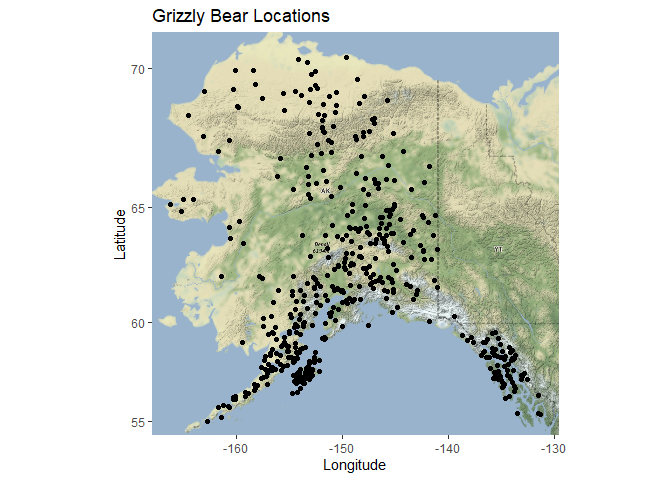
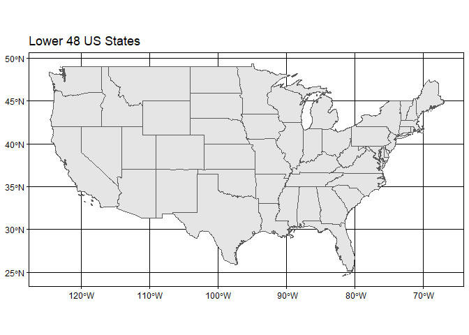
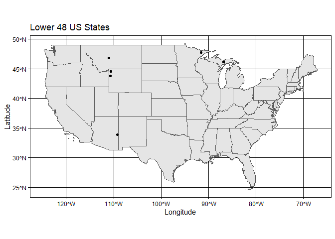
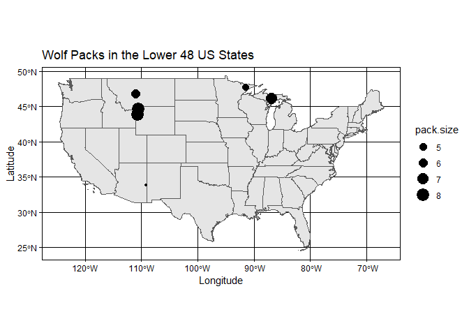

## Instructions
Answer the following questions and complete the exercises in RMarkdown. Please embed all of your code and push your final work to your repository. Your final lab report should be organized, clean, and run free from errors. Remember, you must remove the `#` for the included code chunks to run. Be sure to add your name to the author header above. For any included plots, make sure they are clearly labeled. You are free to use any plot type that you feel best communicates the results of your analysis.  

Make sure to use the formatting conventions of RMarkdown to make your report neat and clean!  

## Load the libraries

```r
library(tidyverse)
library(janitor)
library(here)
library(ggmap)
library(albersusa)
```

## Load the Data
We will use two separate data sets for this homework.  

1. The first [data set](https://rcweb.dartmouth.edu/~f002d69/workshops/index_rspatial.html) represent sightings of grizzly bears (Ursos arctos) in Alaska.  
2. The second data set is from Brandell, Ellen E (2021), Serological dataset and R code for: Patterns and processes of pathogen exposure in gray wolves across North America, Dryad, [Dataset](https://doi.org/10.5061/dryad.5hqbzkh51).  

1. Load the `grizzly` data and evaluate its structure. As part of this step, produce a summary that provides the range of latitude and longitude so you can build an appropriate bounding box.

```r
grizzly <- readr::read_csv("data/bear-sightings.csv")
```

```
## 
## -- Column specification --------------------------------------------------------
## cols(
##   bear.id = col_double(),
##   longitude = col_double(),
##   latitude = col_double()
## )
```

```r
grizzly
```

```
## # A tibble: 494 x 3
##    bear.id longitude latitude
##      <dbl>     <dbl>    <dbl>
##  1       7     -149.     62.7
##  2      57     -153.     58.4
##  3      69     -145.     62.4
##  4      75     -153.     59.9
##  5     104     -143.     61.1
##  6     108     -150.     62.9
##  7     115     -152.     68.0
##  8     116     -147.     62.6
##  9     125     -157.     60.2
## 10     135     -156.     58.9
## # ... with 484 more rows
```


```r
grizzly %>% 
  select(latitude, longitude) %>% 
  summary()
```

```
##     latitude       longitude     
##  Min.   :55.02   Min.   :-166.2  
##  1st Qu.:58.13   1st Qu.:-154.2  
##  Median :60.97   Median :-151.0  
##  Mean   :61.41   Mean   :-149.1  
##  3rd Qu.:64.13   3rd Qu.:-145.6  
##  Max.   :70.37   Max.   :-131.3
```

2. Use the range of the latitude and longitude to build an appropriate bounding box for your map.

```r
lat <- c(55.02, 70.37)
long <- c(-166.2, -131.3)
bbox <- make_bbox(long, lat, f = 0.05)
```

3. Load a map from `stamen` in a terrain style projection and display the map.

```r
map_1 <- get_map(bbox, maptype = "terrain", source = "stamen")
```

```
## Source : http://tile.stamen.com/terrain/5/1/6.png
```

```
## Source : http://tile.stamen.com/terrain/5/2/6.png
```

```
## Source : http://tile.stamen.com/terrain/5/3/6.png
```

```
## Source : http://tile.stamen.com/terrain/5/4/6.png
```

```
## Source : http://tile.stamen.com/terrain/5/1/7.png
```

```
## Source : http://tile.stamen.com/terrain/5/2/7.png
```

```
## Source : http://tile.stamen.com/terrain/5/3/7.png
```

```
## Source : http://tile.stamen.com/terrain/5/4/7.png
```

```
## Source : http://tile.stamen.com/terrain/5/1/8.png
```

```
## Source : http://tile.stamen.com/terrain/5/2/8.png
```

```
## Source : http://tile.stamen.com/terrain/5/3/8.png
```

```
## Source : http://tile.stamen.com/terrain/5/4/8.png
```

```
## Source : http://tile.stamen.com/terrain/5/1/9.png
```

```
## Source : http://tile.stamen.com/terrain/5/2/9.png
```

```
## Source : http://tile.stamen.com/terrain/5/3/9.png
```

```
## Source : http://tile.stamen.com/terrain/5/4/9.png
```

```
## Source : http://tile.stamen.com/terrain/5/1/10.png
```

```
## Source : http://tile.stamen.com/terrain/5/2/10.png
```

```
## Source : http://tile.stamen.com/terrain/5/3/10.png
```

```
## Source : http://tile.stamen.com/terrain/5/4/10.png
```


```r
ggmap(map_1)
```

<!-- -->

4. Build a final map that overlays the recorded observations of grizzly bears in Alaska.

```r
ggmap(map_1)+
  geom_point(data = grizzly, aes(x=longitude, y=latitude))+
  labs(x="Longitude", y="Latitude", title = "Grizzly Bear Locations")
```

<!-- -->

5. Let's switch to the wolves data. Load the data and evaluate its structure.

```r
wolves <- readr::read_csv("data/wolves_data/wolves_dataset.csv")
```

```
## 
## -- Column specification --------------------------------------------------------
## cols(
##   .default = col_double(),
##   pop = col_character(),
##   age.cat = col_character(),
##   sex = col_character(),
##   color = col_character()
## )
## i Use `spec()` for the full column specifications.
```

```r
wolves
```

```
## # A tibble: 1,986 x 23
##    pop     year age.cat sex   color   lat  long habitat human pop.density
##    <chr>  <dbl> <chr>   <chr> <chr> <dbl> <dbl>   <dbl> <dbl>       <dbl>
##  1 AK.PEN  2006 S       F     G      57.0 -158.    254.  10.4           8
##  2 AK.PEN  2006 S       M     G      57.0 -158.    254.  10.4           8
##  3 AK.PEN  2006 A       F     G      57.0 -158.    254.  10.4           8
##  4 AK.PEN  2006 S       M     B      57.0 -158.    254.  10.4           8
##  5 AK.PEN  2006 A       M     B      57.0 -158.    254.  10.4           8
##  6 AK.PEN  2006 A       M     G      57.0 -158.    254.  10.4           8
##  7 AK.PEN  2006 A       F     G      57.0 -158.    254.  10.4           8
##  8 AK.PEN  2006 P       M     G      57.0 -158.    254.  10.4           8
##  9 AK.PEN  2006 S       F     G      57.0 -158.    254.  10.4           8
## 10 AK.PEN  2006 P       M     G      57.0 -158.    254.  10.4           8
## # ... with 1,976 more rows, and 13 more variables: pack.size <dbl>,
## #   standard.habitat <dbl>, standard.human <dbl>, standard.pop <dbl>,
## #   standard.packsize <dbl>, standard.latitude <dbl>, standard.longitude <dbl>,
## #   cav.binary <dbl>, cdv.binary <dbl>, cpv.binary <dbl>, chv.binary <dbl>,
## #   neo.binary <dbl>, toxo.binary <dbl>
```

6. How many distinct wolf populations are included in this study? Mae a new object that restricts the data to the wolf populations in the lower 48 US states.

```r
wolves$pop <- as.factor(wolves$pop)
```


```r
wolves %>%
  summarize(n_wolf_pop = n_distinct(pop))
```

```
## # A tibble: 1 x 1
##   n_wolf_pop
##        <int>
## 1         17
```


```r
wolves_48 <- wolves %>%
  filter(lat<=49) %>%
  arrange(desc(lat))
wolves_48
```

```
## # A tibble: 1,169 x 23
##    pop    year age.cat sex   color   lat  long habitat human pop.density
##    <fct> <dbl> <chr>   <chr> <chr> <dbl> <dbl>   <dbl> <dbl>       <dbl>
##  1 SNF    2010 S       M     G      47.7 -91.5  32018. 4558.        25.3
##  2 SNF    2010 P       M     G      47.7 -91.5  32018. 4558.        25.3
##  3 SNF    2010 S       F     G      47.7 -91.5  32018. 4558.        25.3
##  4 SNF    2010 S       F     G      47.7 -91.5  32018. 4558.        25.3
##  5 SNF    2010 P       F     G      47.7 -91.5  32018. 4558.        25.3
##  6 SNF    2010 P       M     G      47.7 -91.5  32018. 4558.        25.3
##  7 SNF    2010 S       F     G      47.7 -91.5  32018. 4558.        25.3
##  8 SNF    2010 A       F     G      47.7 -91.5  32018. 4558.        25.3
##  9 SNF    2010 S       M     G      47.7 -91.5  32018. 4558.        25.3
## 10 SNF    2010 S       M     G      47.7 -91.5  32018. 4558.        25.3
## # ... with 1,159 more rows, and 13 more variables: pack.size <dbl>,
## #   standard.habitat <dbl>, standard.human <dbl>, standard.pop <dbl>,
## #   standard.packsize <dbl>, standard.latitude <dbl>, standard.longitude <dbl>,
## #   cav.binary <dbl>, cdv.binary <dbl>, cpv.binary <dbl>, chv.binary <dbl>,
## #   neo.binary <dbl>, toxo.binary <dbl>
```

```r
wolves_48 %>%
  summarize(n_wolf_pop_48 = n_distinct(pop))
```

```
## # A tibble: 1 x 1
##   n_wolf_pop_48
##           <int>
## 1             6
```

7. Use the `albersusa` package to make a base map of the lower 48 US states.

```r
us_comp <- usa_sf()
us_comp
```

```
## Simple feature collection with 51 features and 13 fields
## geometry type:  MULTIPOLYGON
## dimension:      XY
## bbox:           xmin: -124.7332 ymin: 20.63151 xmax: -66.9499 ymax: 49.38436
## geographic CRS: WGS 84
## First 10 features:
##         geo_id fips_state                 name lsad census_area iso_3166_2
## 1  0400000US04         04              Arizona       113594.084         AZ
## 2  0400000US05         05             Arkansas        52035.477         AR
## 3  0400000US06         06           California       155779.220         CA
## 4  0400000US08         08             Colorado       103641.888         CO
## 5  0400000US09         09          Connecticut         4842.355         CT
## 6  0400000US11         11 District of Columbia           61.048         DC
## 7  0400000US13         13              Georgia        57513.485         GA
## 8  0400000US17         17             Illinois        55518.930         IL
## 9  0400000US18         18              Indiana        35826.109         IN
## 10 0400000US22         22            Louisiana        43203.905         LA
##      census pop_estimataes_base pop_2010 pop_2011 pop_2012 pop_2013 pop_2014
## 1   6392017             6392310  6411999  6472867  6556236  6634997  6731484
## 2   2915918             2915958  2922297  2938430  2949300  2958765  2966369
## 3  37253956            37254503 37336011 37701901 38062780 38431393 38802500
## 4   5029196             5029324  5048575  5119661  5191709  5272086  5355866
## 5   3574097             3574096  3579345  3590537  3594362  3599341  3596677
## 6    601723              601767   605210   620427   635040   649111   658893
## 7   9687653             9688681  9714464  9813201  9919000  9994759 10097343
## 8  12830632            12831587 12840097 12858725 12873763 12890552 12880580
## 9   6483802             6484192  6490308  6516560  6537632  6570713  6596855
## 10  4533372             4533479  4545581  4575972  4604744  4629284  4649676
##                          geometry
## 1  MULTIPOLYGON (((-112.5386 3...
## 2  MULTIPOLYGON (((-94.04296 3...
## 3  MULTIPOLYGON (((-120.2485 3...
## 4  MULTIPOLYGON (((-107.3178 4...
## 5  MULTIPOLYGON (((-72.39743 4...
## 6  MULTIPOLYGON (((-77.03299 3...
## 7  MULTIPOLYGON (((-84.81048 3...
## 8  MULTIPOLYGON (((-89.36603 4...
## 9  MULTIPOLYGON (((-84.80412 4...
## 10 MULTIPOLYGON (((-88.86507 2...
```


```r
not_alaska_hawaii <- us_comp %>%
  filter(name!="Alaska" & name!="Hawaii") 
```


```r
wolves %>% 
  ggplot() + 
  geom_sf(data = not_alaska_hawaii, size = 0.125) + 
  theme_linedraw()+
  labs(title = "Lower 48 US States")
```

<!-- -->
8. Use the relimited data to plot the distribution of wolf populations in the lower 48 US states.

```r
wolves %>% 
  ggplot() + 
  geom_sf(data = not_alaska_hawaii, size = 0.125) + 
  theme_linedraw()+
  labs(title = "Lower 48 US States",
       x="Longitude", y="Latitude") +
  geom_point(data=wolves_48, aes(long, lat))
```

<!-- -->

9. What is the average pack size for the wolves in this study by region?

```r
wolves %>%
  group_by(pop) %>%
  summarize(mean_pack_size = mean(pack.size))
```

```
## # A tibble: 17 x 2
##    pop     mean_pack_size
##  * <fct>            <dbl>
##  1 AK.PEN            8.78
##  2 BAN.JAS           9.56
##  3 BC                5.88
##  4 DENALI            6.45
##  5 ELLES             9.19
##  6 GTNP              8.1 
##  7 INT.AK            6.24
##  8 MEXICAN           4.04
##  9 MI                7.12
## 10 MT                5.62
## 11 N.NWT             4   
## 12 ONT               4.37
## 13 SE.AK             5   
## 14 SNF               4.81
## 15 SS.NWT            3.55
## 16 YNP               8.25
## 17 YUCH              6.37
```

10. Make a new map that shows the distribution of wolves in the lower 48 US states but which has the size of location markers adjusted by pack size.

```r
wolves %>% 
  ggplot() + 
  geom_sf(data = not_alaska_hawaii, size=0.125) + 
  theme_linedraw()+
  labs(title = "Wolf Packs in the Lower 48 US States", 
       x="Longitude", y="Latitude") +
  geom_point(data=wolves_48, aes(long, lat, size=pack.size))
```

<!-- -->

## Push your final code to GitHub!
Please be sure that you check the `keep md` file in the knit preferences. 
